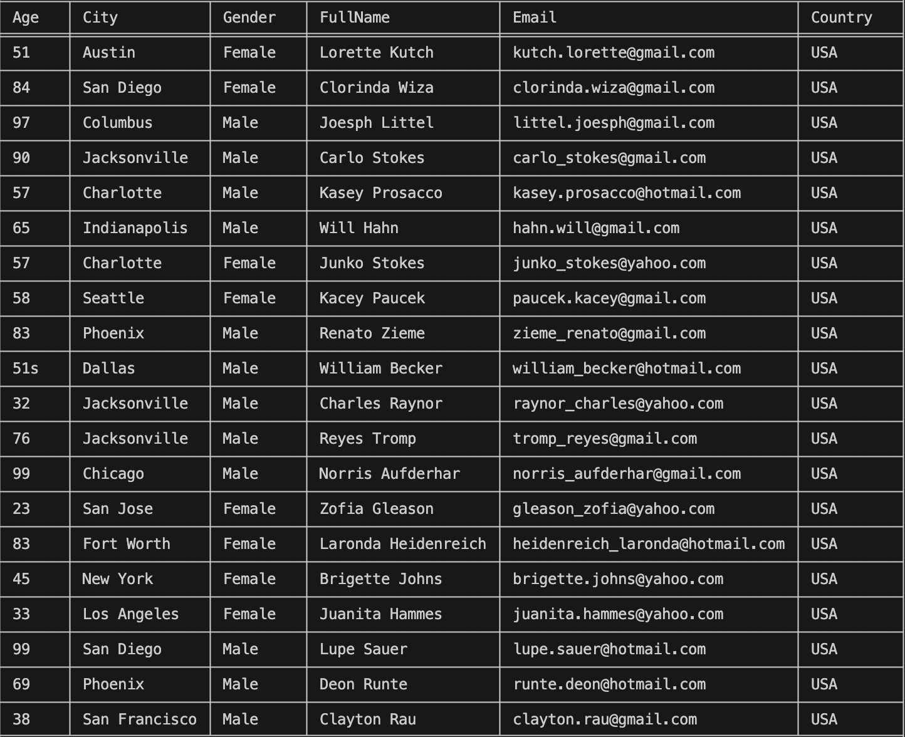

## My_M_And_A

* First of all I created the necessary repositories and files
```
    repo -> My_M_And_A
        my_ds_babel.py
        my_m_and_a.py
```
* Secondly, we download all the necessary data in csv format
```
    only_wood_customer_us_1.csv
    only_wood_customer_us_1.csv
    only_wood_customer_us_1.csv
```
* Thirdly, we download all the necessary libraries for working with data
```
    pip install pandas
    pip install db-sqlite3
    pip install tabulate
```
## Description

Well, let's get started. Here we first download and read the contents of the clicked csv using the `def load_dataset(path)` function.
For easy reading and introduction, I use the tabulate library in the `def pretty_print(df)` function.
After reading the file, we must correct some errors like (;, -, :, /) using the `def clean_dataset_1(df)` function.
And the simplest thing is that we need to combine all our data using the `def func()` function.
We create another file called `my_ds_babel.py` and import our merged csv file.
Import all the necessary libraries `import sqlite3`, and yes I forgot something. 
We have to import our function from our main code into a new one `from my_m_and_a import func`, and create another function that simply turns our cat file into a sql file `def to_sql(merged_df)`.


